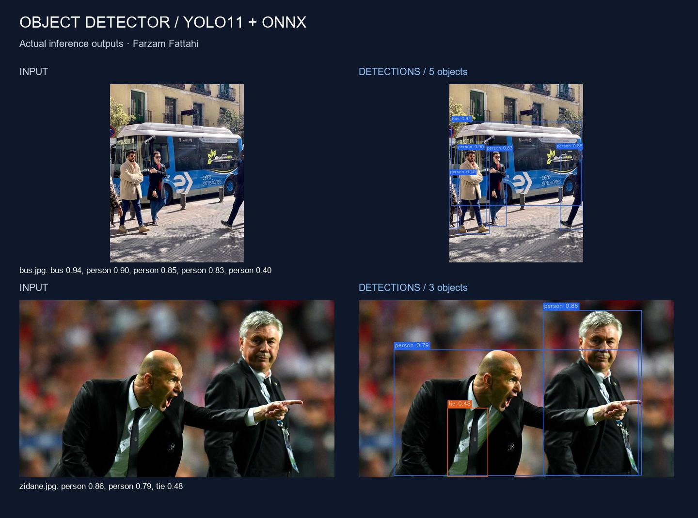
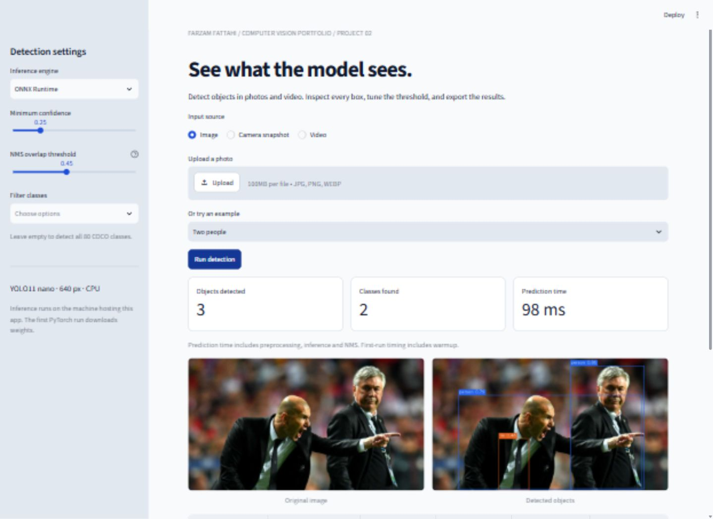
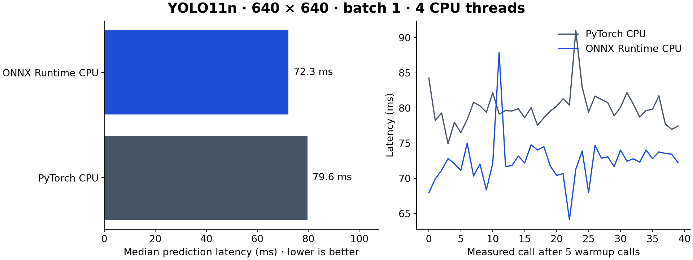
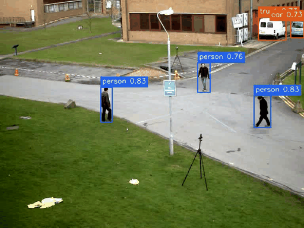

# Object Detector

[](https://github.com/FarzamFattahi/object-detector/actions/workflows/ci.yml)


Detect objects in images, videos and a local webcam with **YOLO11n**, including a
fine-tuned **Construction-PPE** model for eleven equipment/person label categories.
Inspect results in a Streamlit dashboard or use the CLI in a data pipeline. Deploy the
same model through an **independent ONNX Runtime backend** with explicit preprocessing,
decoding and class-aware NMS.

Built by **Farzam Fattahi**: dataset validation, similarity-based leakage filtering,
transfer learning, held-out evaluation, error analysis and deployment. The general
COCO model uses upstream weights; the PPE checkpoint is fine-tuned from those weights.

## Construction-PPE case study

The upstream 1,416-image dataset contains related frames across its original splits.
Our reproducible pHash grouping excludes 165 training and 14 validation images before
fine-tuning, leaving **967 train / 129 validation / 141 test** images. The checkpoint
is selected on validation only. This is image-level evaluation with heuristic
similarity filtering; it does not establish generalization to unseen sites.


Read the [complete experiment and PyTorch training explanation](docs/PPE_CASE_STUDY.md)
for the recipe, measured per-class results, learning curves, and strong/typical/weak
test predictions. The evidence includes every test prediction, annotation support,
dataset provenance and checkpoint hashes.

```powershell
# After installing the project below:
python scripts/download_ppe_model.py
cv-detect detect --source assets/ppe/samples/test-1.jpg --model models/ppe-yolo11n.onnx --backend onnx
streamlit run app.py  # select Construction PPE
```



## Try it

Use Python 3.10–3.13; Python 3.12 is the tested local environment. From a fresh clone:

```powershell
git clone https://github.com/FarzamFattahi/object-detector.git
cd object-detector
python -m venv .venv
.\.venv\Scripts\Activate.ps1
python -m pip install torch==2.8.0 torchvision==0.23.0 --index-url https://download.pytorch.org/whl/cpu
python -m pip install -r requirements.txt
python scripts/download_samples.py --video
streamlit run app.py
```

On Linux/macOS, replace the activation command with `source .venv/bin/activate`.
If your default Python is 3.14+, create the environment with an installed supported
interpreter, for example `py -3.12 -m venv .venv` on Windows.
Open [localhost:8501](http://localhost:8501). Try the examples, upload a photo/video,
or take a camera snapshot. The first PyTorch run downloads the 5.4 MB weights.
Examples/weights require internet once; uploaded-image inference then runs locally.

For the exact **Windows Python 3.12 CPU environment used for the measurements**:

```powershell
python -m pip install -r requirements-lock-cpu.txt --extra-index-url https://download.pytorch.org/whl/cpu
python -m pip install -e . --no-deps
```

The lock snapshot is specific to the measured environment; use `requirements.txt`
for dependency resolution on other Python versions/platforms. GPU use requires a
CUDA-compatible PyTorch installation from the [official installer](https://pytorch.org/get-started/locally/).
The original COCO CPU measurements below remain from v1.0.0. The PPE experiment
records its own training/evaluation environment separately.

## Features

- Image, nonrecursive image-directory, recorded-video and live local webcam detection.
- Pretrained 80-class COCO model; confidence, IoU and class filters.
- Fine-tuned 11-class Construction-PPE model, audited dataset manifests and test evidence.
- Typed prediction API with rectangles in original-image pixel coordinates.
- Annotated PNG + JSON for each image; video + one JSONL record per frame.
- Static FP32 ONNX export and independent CPU inference with NumPy/OpenCV postprocessing.
- Dashboard with image comparison, counts, detection table, downloads, camera snapshots
  and H.264 video preview.
- Warmed latency benchmarking, backend parity checks, labeled evaluation, tests and CI.



## CLI

```powershell
# Image or directory; --output is a directory.
cv-detect detect --source data/bus.jpg --output outputs/photo
cv-detect detect --source data --output outputs/batch --classes 0 2 5

# Full recorded video, or limit work to a short segment.
cv-detect detect --source data/vtest.avi --output outputs/video
cv-detect detect --source data/vtest.avi --max-frames 60

# Explicitly open local camera 0; Q or Ctrl+C stops and releases handles.
cv-detect detect --source webcam:0 --show

# Export and use the independent ONNX CPU backend.
cv-detect export --output models/yolo11n.onnx
cv-detect detect --source data/bus.jpg --backend onnx --model models/yolo11n.onnx

# CUDA, if you installed a compatible CUDA PyTorch build.
cv-detect detect --source data/bus.jpg --device 0

cv-detect --help
cv-detect detect --help
```

`python -m object_detector` is equivalent to `cv-detect`. Image outputs are named
`<original-filename>_detected.png` with a matching `.json` sidecar. A video produces
`<stem>_detected.mp4`, `<stem>_detected.jsonl` and `<stem>_summary.json`.
The CLI writes silent `mp4v` video, playable in VLC; the dashboard converts to H.264
for browser playback. Audio is not preserved. Dashboard video processing is bounded
to the selected frame count (maximum 900); the CLI streams a full video in constant
frame memory. Predictions are independent per frame, without object tracking IDs.

## Python API

```python
from object_detector import Detector, DetectorConfig
from object_detector.annotation import annotate
from object_detector.media import read_image, write_image

detector = Detector(DetectorConfig(confidence=0.4, classes=(0, 5)))
image = read_image("data/bus.jpg")  # HWC BGR uint8
prediction = detector.predict(image)
write_image("outputs/annotated.png", annotate(image, prediction))
for detection in prediction.detections:
    print(detection.label, detection.confidence, detection.xyxy)
```

ONNX expects our static batch-one FP32 YOLO11 detection export, without embedded NMS
and with class-name metadata. Use the same `--image-size` as the export.
Unsupported layouts fail with descriptive errors.

## Measured performance

Local Windows CPU run, **AMD Ryzen 7 7435HS**, Python 3.12, YOLO11n FP32,
640×640 input, batch one, four CPU threads. Two photos alternated over
40 measured calls per backend after five warmup calls.

| Engine | Median latency | p95 latency | Prediction FPS, from mean latency |
|---|---:|---:|---:|
| PyTorch CPU | 79.6 ms | 83.0 ms | 12.5 |
| ONNX Runtime CPU | 72.3 ms | 74.8 ms | 13.8 |

Timing includes preprocessing, inference and NMS; excludes model load, reading,
drawing and encoding. These are machine-specific observations, not a universal
real-time guarantee. See [raw calls, configuration, hashes and environment](assets/results.json).



**Deployment parity:** all **32 detections** matched one-to-one across two photos
and four real video frames. Minimum matched-box IoU was **0.9999938**; maximum
coordinate difference was **0.000244 pixel**. This checks backend agreement, not accuracy.

**Video:** 60 frames processed at **12.5 FPS**, including decoding, drawing, encoding
and JSONL writes. The source is 10 FPS. The GIF samples every second source frame
and retains the six-second playback duration; playback speed is not inference FPS.



**Labeled smoke test:** COCO8's four validation images / 17 instances gave mAP50
0.815 and mAP50–95 0.610. [Raw smoke metrics](assets/evaluation.json).
COCO8 is tiny and derived from COCO training images. These scores do **not** establish
held-out accuracy. Evaluate an independent dataset before making accuracy claims.

## Reproduce evidence

```powershell
python scripts/download_samples.py --video
cv-detect export
python scripts/make_evidence.py --repeats 40 --video-frames 60
cv-detect evaluate --data coco8.yaml --output outputs/evaluation

# Benchmark your own inputs independently.
cv-detect benchmark --source data/bus.jpg --repeats 40 --output outputs/torch-benchmark.json
cv-detect benchmark --source data/bus.jpg --backend onnx --model models/yolo11n.onnx --output outputs/onnx-benchmark.json
```

The evidence script regenerates the gallery, plot, GIF and raw report, and fails
if parity does not match at IoU ≥ 0.99. COCO8 downloads automatically on first evaluation.
Inputs/weights stay out of source control. The
[v1.0.0 release](https://github.com/FarzamFattahi/object-detector/releases/tag/v1.0.0)
also includes the verified ONNX graph.

## Architecture and learning

```text
src/object_detector/
  config.py       Validated immutable settings
  backends.py     PyTorch wrapper + independent ONNX inference
  geometry.py     Letterbox, IoU, NMS and coordinate restoration
  detector.py     Common interface and latency measurement
  annotation.py   Boxes and labels
  media.py        Image I/O and streaming video/JSONL
  benchmark.py    Warmed timing and one-to-one parity
  cli.py          Detection, export, benchmark and evaluation
  ppe_dataset.py  Label validation, exact hashes and perceptual similarity grouping
  evaluation.py   One-to-one operating-point TP/FP/FN matching
  download.py     Resumable, length-checked and hash-verified downloads
app.py            Streamlit dashboard
tests/            Offline geometry, decoding, I/O and error-path tests
scripts/          Download, dataset audit, fine-tuning, evaluation and evidence generation
configs/          Fixed PPE training recipe
```

Read the [learning guide](docs/LEARNING_GUIDE.md) for PyTorch fundamentals, the
geometry behind the implementation, an interview-ready description and exercises.
The [portfolio audit](docs/PROJECT_SELECTION.md) explains the selection. YOLO11 is
retained as the original brief's compact baseline, without claiming it is the latest model.

```powershell
python -m pip install -e ".[dev]"
pytest -q
ruff check .
ruff format --check .
python -m build
```

Tests do not download weights/datasets. They cover NMS, asymmetric letterboxing,
BGR/RGB normalization, coordinate roundtrips, class filters, export validation,
corrupt files, Unicode image paths, video frame/timestamp consistency and cleanup
after inference failures. Real-model evidence is reproduced separately.

## Limits and credits

Small, occluded and out-of-domain objects can be missed. Scores are not calibrated
probabilities. There is no tracking, audio preservation or REST API in this release.
Physical webcam behavior was not verified. Construction-PPE labels are predictions,
not verified worker compliance; missing detections do not establish missing equipment.
See the case study for rare labels, related scenes and evaluation limitations.
Camera snapshots use the browser camera; continuous webcam uses the explicit CLI.

Code is **AGPL-3.0-only**, matching the Ultralytics dependency/model license; see
[LICENSE](LICENSE) and [upstream YOLO11 docs](https://docs.ultralytics.com/models/yolo11/).
Pretrained weights/demo inputs are credited in [evidence sources](assets/SOURCES.md).
Construction-PPE dataset authors and the included sample images are credited in the
[case study](docs/PPE_CASE_STUDY.md) and `assets/ppe/sample_sources.json`.
The input photographs/video are third-party material; their rights remain with their sources.
