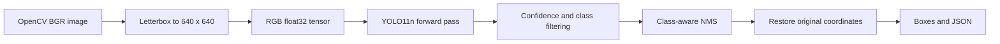

# Understanding and owning this project

This project combines inference/deployment with a dataset-specific fine-tuning
experiment. The general detector uses Ultralytics' COCO weights; the PPE detector
adapts those weights on audited Construction-PPE data. The application, independent
ONNX pipeline, geometry, I/O, data audit, training/evaluation workflow and evidence
are implemented here. The architecture is upstream YOLO11, not a new architecture
trained from scratch. This guide explains inference; the
[PPE case study](PPE_CASE_STUDY.md) explains training and its measured results.

## What problem are we solving?

Classification produces one label for an image. Object detection produces a list of
objects, each with a class, confidence score and rectangle. Segmentation goes further
and assigns pixels to objects. The general profile detects the 80 pretrained COCO
classes: people, vehicles, animals and everyday objects. The fine-tuned profile
predicts eleven construction equipment/person categories, with different class IDs.

The original folder contained a plan and README, but no executable detector. It also
claimed 30+ CPU FPS without measurements. The implementation now supports images,
directories, recorded videos, explicit local webcam access, an interactive dashboard,
JSON exports and a separate ONNX deployment path.

## Follow one image through the system



**1. Images and tensors.** An OpenCV image is a NumPy `uint8` array with shape
`(height, width, 3)`, in BGR channel order. Neural networks expect a batch dimension,
channel-first RGB and normalized floats. The ONNX backend makes this conversion explicit:

```python
tensor = np.ascontiguousarray(padded[:, :, ::-1].transpose(2, 0, 1)[None], dtype=np.float32) / 255.0
# shape: (1, 3, 640, 640)
```

`[None]` adds the batch dimension. `transpose` changes HWC to CHW. A contiguous array
places the values in the memory layout expected by the runtime. In PyTorch, the same
idea is `torch.from_numpy(tensor)`. Our PyTorch backend delegates preprocessing to the
tested Ultralytics predictor; the ONNX backend implements it independently.

**2. Letterboxing.** Stretching a wide image into a square changes the shapes of objects.
Instead, resize with one scale factor `r = min(640 / height, 640 / width)` and pad the
remaining space. Keep the padding and scale so the output boxes can be mapped back:

```text
x_original = (x_model - left_padding) / r
y_original = (y_model - top_padding) / r
```

**3. The network.** Convolutions learn local patterns and combine them into features.
YOLO's backbone extracts features, its neck combines information across scales, and
its detection head predicts positions and class scores. The nano variant is a small
deployment baseline. No optimizer or backward pass runs during inference. Ultralytics
handles inference mode for PyTorch; ONNX Runtime executes the exported computation graph.

**4. Decode the output.** For the 640-pixel COCO YOLO11 detection export, the raw
tensor is `[1, 84, 8400]`: four coordinates and 80 class scores for each candidate.
The four coordinates are center x, center y, width and height. Convert them to corners:

```text
x1 = cx - width / 2       x2 = cx + width / 2
y1 = cy - height / 2      y2 = cy + height / 2
```

Unlike some older YOLO formats, this output has no separate objectness column.
Multiplying the wrong columns would silently damage confidence scores.

**5. Confidence and NMS.** Many candidates describe the same object. Keep the highest
scoring candidate and suppress strongly overlapping candidates of the same class.
Overlap is intersection over union: `IoU = intersection_area / union_area`.
Two overlapping boxes of different classes remain separate. The score is useful for
ranking predictions; it is not a calibrated probability that a detection is correct.

**6. Video.** A video is a sequence of images plus timing information. We decode one
frame, predict, draw, encode and write one JSONL row, then move to the next frame.
Memory does not grow with video length in the CLI. `try/finally` releases capture,
encoder and record handles even if prediction fails. Playback keeps the source FPS;
processing FPS measures how quickly the computer executes the pipeline. These are
different. This is per-frame detection, so it does not assign persistent tracking IDs.

## Why export to ONNX?

A `.pt` checkpoint is useful in the training ecosystem. An ONNX graph can run in a
separate inference runtime. Here the ONNX backend imports neither PyTorch nor
Ultralytics, and implements preprocessing/postprocessing with NumPy and OpenCV.
The default installation includes both backends for comparison, but the ONNX code
itself only needs those libraries and ONNX Runtime.

Export alone is insufficient: a model can export successfully while receiving the
wrong channel order, padding or normalization in production. We compare actual boxes
from both backends with one-to-one class matches and IoU at least 0.99. The report also
records coordinate and confidence differences. Agreement verifies deployment parity,
not whether the model is right about the world.

## How to read the evidence

- `assets/detections.jpg`: real inputs beside actual predicted boxes.
- `assets/demo.gif`: actual detection on an upstream pedestrian video.
- `assets/benchmark.png`: measured warmed latency, with the raw calls in `results.json`.
- `assets/results.json`: environment, configuration, model/input hashes, boxes, parity,
  latency samples and video processing statistics.
- `assets/evaluation.json`: optional tiny COCO8 sanity evaluation. Its images come from
  COCO training data, so its scores are not held-out accuracy or generalization evidence.
- `assets/ppe/metrics.json`: the full held-out dataset evaluation, class support,
  Person-only baseline and fixed-threshold errors.
- `assets/ppe/test_gallery.jpg`: dataset annotations beside selected strong, median
  and weak predictions; all test records are in `ppe/test_predictions.json`.
- `assets/ppe/training.csv` and `learning_curves.png`: training/validation progress,
  kept separate from final testing. Read [the model card](PPE_MODEL_CARD.md) for limits.

Median describes a typical call; p95 exposes slow calls. The prediction benchmark
includes preprocessing, inference and NMS, but excludes disk I/O and drawing. The video
summary includes decode, drawing and encoding. Both exclude model loading. Hardware,
thread count, image size, thermal state and background work affect the numbers.

## Run and inspect it yourself

```powershell
cv-detect detect --source data/bus.jpg --output outputs/my-first-run
cv-detect detect --source data/bus.jpg --classes 0 --confidence 0.5
cv-detect export
cv-detect detect --source data/bus.jpg --backend onnx --model models/yolo11n.onnx
```

Open the JSON and map each rectangle back to the displayed image. Raise confidence
and observe what disappears. Change NMS IoU and inspect overlaps. Compare PyTorch
and ONNX outputs. For a practical PyTorch exercise, use:

```python
import cv2
import torch
from object_detector.geometry import letterbox

image = cv2.imread("data/bus.jpg")
padded, scale, padding = letterbox(image, 640)
x = torch.from_numpy(padded[:, :, ::-1].copy())
x = x.permute(2, 0, 1).unsqueeze(0).float() / 255
print(x.shape, x.dtype, x.min().item(), x.max().item())
# torch.Size([1, 3, 640, 640]), float32, values in [0, 1]
```

Then read `geometry.py`, `backends.py`, `media.py`, and the corresponding tests.
These are the portions you should understand and be able to explain in an interview.

## Portfolio description you can defend

“Fine-tuned YOLO11n on Construction-PPE after auditing labels and filtering related
frames across dataset splits. Published held-out per-class evaluation, learning curves
and error examples. Built an image/video detection application and implemented
an independent ONNX Runtime inference backend with letterboxing, tensor conversion,
class-aware NMS and coordinate restoration. Added a Streamlit dashboard, streaming
video/JSONL output, tests and CI. Reproduced CPU latency measurements and compared
PyTorch/ONNX detection parity on real images and video frames.”

Describe the measured results from this machine rather than promising universal FPS.
The model can miss small, occluded or out-of-domain objects. The PPE case study
evaluates one benchmark with heuristic similarity filtering; it does not establish
unseen-site generalization. Physical webcam behavior needs to be checked on the
intended deployment machine.

## Good next steps after this release

1. Work through [the PPE fine-tuning case study](PPE_CASE_STUDY.md). Trace a YOLO
   annotation into a minibatch, loss calculation, gradient and optimizer update.
2. Collect new site-held-out data and review rare/ambiguous labels. Compare frozen
   backbone and full fine-tuning under equal training budgets on validation, then
   evaluate the selected recipe once on an independent test set.
3. Add a tracker if the task needs unique object counts across video frames.
4. Compare CPU ONNX, CUDA PyTorch and TensorRT under the same benchmark conditions.

Sources: [Ultralytics YOLO11](https://docs.ultralytics.com/models/yolo11/),
[export documentation](https://docs.ultralytics.com/modes/export/),
[COCO8 dataset](https://docs.ultralytics.com/datasets/detect/coco8/).
