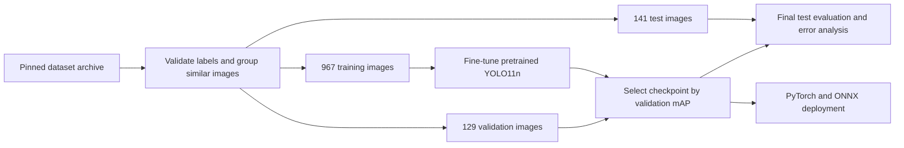

# Construction equipment detection: from data audit to deployment

This case study extends the general object detector with a domain-specific model.
Construction-PPE uses 11 equipment, person and missing-equipment label categories.
The deliverable is a reproducible fine-tuning experiment, a held-out error analysis,
and a model that runs through both the application and its independent ONNX backend.

## Data quality is part of the project

Source: [Ultralytics Construction-PPE](https://docs.ultralytics.com/datasets/detect/construction-ppe).
Credit: Mrunmayee Dalvi, Niyati Singh, Sahil Bhingarde and Ketaki Chalke (2025).
The upstream archive includes an AGPL-3.0 license. Dataset images in the evidence
gallery are attributed in `assets/ppe/sample_sources.json`; the dataset is not
redistributed wholesale. Archive byte count and SHA-256 are recorded in
`assets/ppe/download.json`.

| Split | Upstream images | Used images | Similarity groups |
|---|---:|---:|---:|
| Train | 1,132 | 967 | 923 |
| Validation | 143 | 129 | 128 |
| Test | 141 | 141 | 131 |

Checking exact decoded-pixel SHA-256 alone found no duplicates. A visual similarity
check revealed related frames across splits. The preparation pipeline therefore:

1. Validates every five-column YOLO label, class ID, finite value and normalized box.
2. Computes exact pixel hashes and 64-bit DCT perceptual hashes.
3. Connects images at pHash Hamming distance ≤8, including transitive connections.
4. Keeps each similarity group in test, otherwise validation, otherwise train.
   It excludes 165 train and 14 validation images; upstream files stay untouched.
5. Writes absolute local manifests, a portable image/label hash audit, and YAML.

This filtering rule was fixed **before training and model evaluation**. Reviewing
test imagery for split construction is not using test predictions to tune the model.
pHash can miss related scenes and group unrelated images. Site/session identifiers
are unavailable, and related images remain within each retained split. The test
score is image-level performance on this filtered benchmark, **not evidence of
generalization to unseen construction sites**. A next deployment study should use
site-held-out data, independent annotation review and group-level uncertainty.


Training labels are imbalanced: 1,606 person boxes versus 88 `no_boots` boxes.
Validation contains only four `no_boots` boxes. The ambiguous upstream `none`
category is retained to preserve label semantics; it is not interpreted as a
particular safety condition. Absence of a predicted helmet is not proof that a
person lacks a helmet. This is an equipment detection research demonstration.

At the 640-pixel letterbox resolution, test glove boxes have a median equivalent
square side of 48.6 px, compared with 281.0 px for people. Ten of the 23 `no_boots`
boxes have an area equivalent to a square of at most 32 px. These are diagnostic
size bins at resized inference resolution, not official COCO size metrics. They
help explain why class support and localization precision need separate inspection;
they do not prove a causal explanation for any particular prediction error.


## Reproduce preparation and fine-tuning

Install the project as described in the README, then install a CUDA build of
PyTorch if training on a compatible NVIDIA GPU:

```powershell
python -m pip install torch==2.8.0 torchvision==0.23.0 --index-url https://download.pytorch.org/whl/cu128
$env:YOLO_CONFIG_DIR = (Get-Location).Path
python scripts/prepare_ppe.py
python scripts/analyze_ppe.py
python scripts/train_ppe.py --device 0
python scripts/evaluate_ppe.py --device 0
```

CPU training is supported explicitly with `--device cpu` but takes substantially
longer. The fixed recipe is in `configs/ppe_train.yaml`: COCO-pretrained YOLO11n,
640 px, batch 8, AdamW, 40 maximum epochs, seed 42 and early stopping patience 12.
The best checkpoint is selected by validation mAP50–95, without test evaluation
during training. Seeded deterministic settings reduce variation; different CUDA,
library and hardware combinations can still change results. Exact package versions,
hardware, initial weights, configuration/source hashes and dataset audit hash are
stored with the experiment evidence.



## Understand the learning process

A pretrained detector already has useful edges, textures and shape features.
Fine-tuning replaces/adapts its 80-class detection head to 11 dataset classes and
updates the backbone as well. This is transfer learning, not training a new
architecture from scratch.

At each minibatch PyTorch builds a computation graph, Ultralytics computes box,
classification and distribution-focal losses, automatic differentiation produces
parameter gradients, and AdamW updates those parameters. Mixed precision reduces
GPU memory usage. Mosaic augmentation combines training images; it is disabled
for the last ten planned epochs. Validation runs without optimization. Loss falling
alone does not establish better detection: validation mAP and the error gallery
show whether learned features transfer to held-out images.

## Evaluation and evidence

`assets/ppe/metrics.json` is the authoritative measured report. It contains test
mAP50, mAP50–95 and per-class AP with annotation support. Standard AP evaluation
uses confidence 0.001 and NMS IoU 0.7. Ultralytics summary precision/recall use its
best-F1 operating point; these are descriptive test summaries, not a deployed
threshold selected on test.

Separately, the gallery and TP/FP/FN counts use a predeclared confidence of 0.25,
NMS IoU 0.45 and same-class matching IoU 0.50. Predictions are matched in descending
confidence order, each annotation at most once. Duplicate predictions count as
false positives. The gallery deliberately includes two strong, two median and
two weak images ranked by equipment F1, excluding `Person` and ambiguous `none`
from that ranking. It is illustrative selection, not a random performance sample.
All test predictions are published so that selection can be inspected.

The original COCO model shares only the `Person` category with this dataset. A
restricted baseline evaluates its person predictions against the same 236 test
person annotations, mapping COCO ID 0 to PPE ID 6. The report compares this with
the fine-tuned model's per-class Person AP. Other COCO categories are excluded;
this is not an eleven-class baseline or a controlled architecture ablation.


## Use the trained model

```powershell
python scripts/download_ppe_model.py
cv-detect detect --source assets/ppe/samples/test-1.jpg --model models/ppe-yolo11n.pt
cv-detect detect --source assets/ppe/samples/test-1.jpg --model models/ppe-yolo11n.onnx --backend onnx
streamlit run app.py
```

Select **Construction PPE** in the dashboard. Its class IDs differ from COCO:
`Person` is 6, `helmet` is 0 and `vest` is 2. Model artifacts are downloaded from
the GitHub release with pinned SHA-256 verification. The independent ONNX decoder
reads class names from model metadata, so its raw output changes from 84 to 15
channels (four box coordinates plus eleven class scores).
