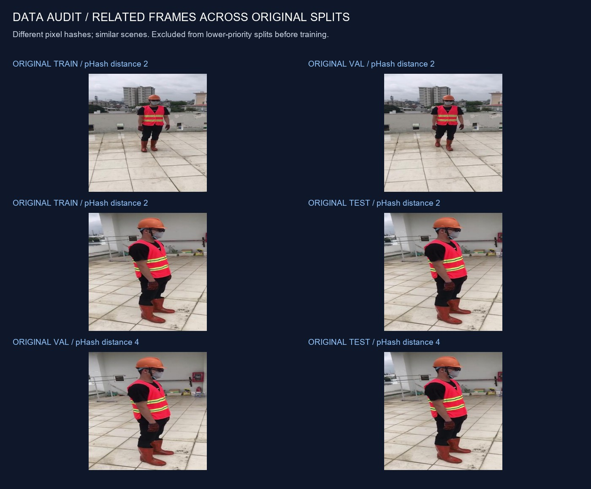
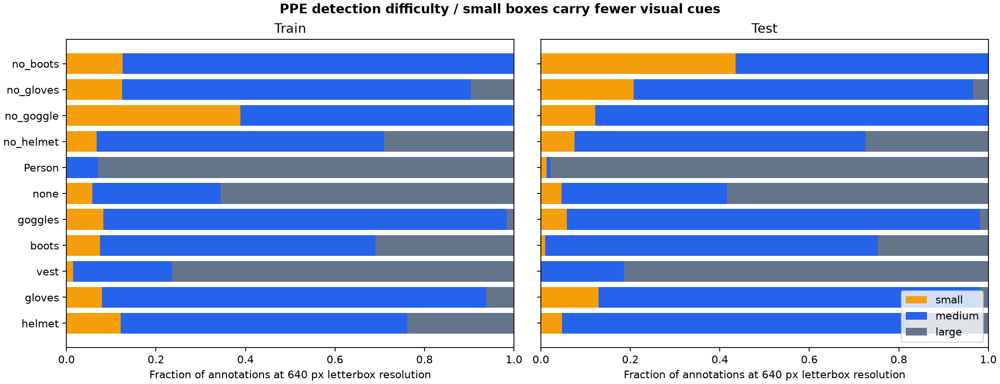
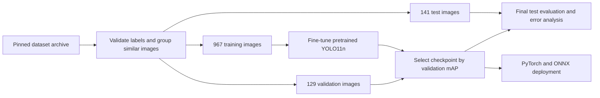
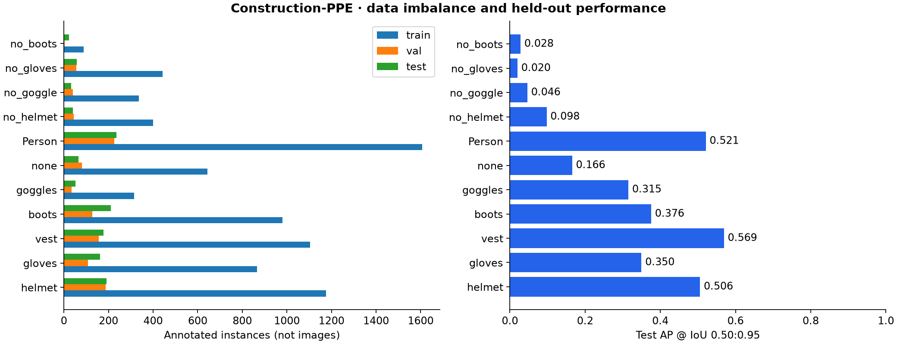
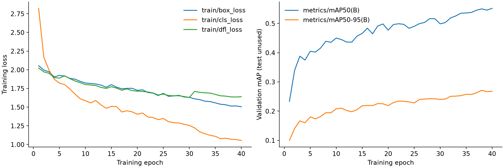
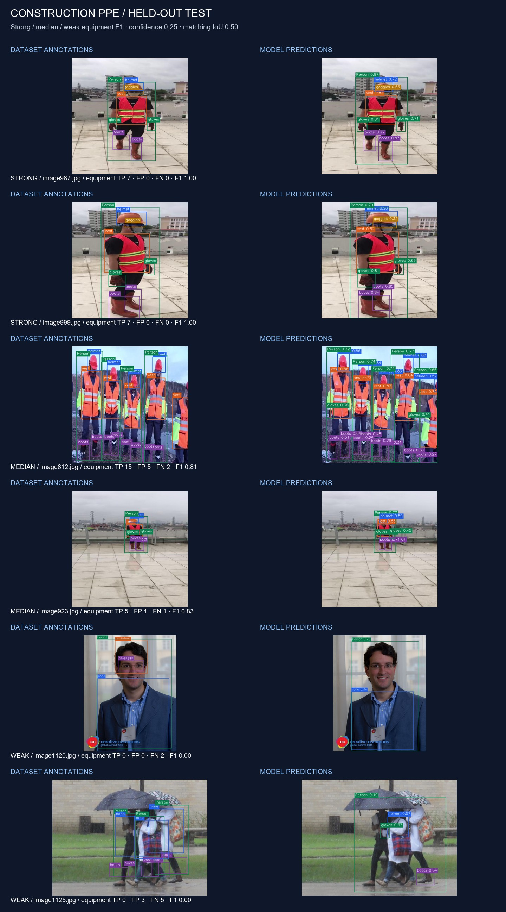

# Construction equipment detection: from data audit to deployment

This case study extends the general object detector with a domain-specific model.
Construction-PPE uses 11 equipment, person and missing-equipment label categories.
The deliverable is a reproducible fine-tuning experiment, a held-out error analysis,
and a model that runs through both the application and its independent ONNX backend.

## Data quality is part of the project

Source: [Ultralytics Construction-PPE](https://docs.ultralytics.com/datasets/detect/construction-ppe).
Credit: Mrunmayee Dalvi, Niyati Singh, Sahil Bhingarde and Ketaki Chalke (2025).
The upstream archive includes an AGPL-3.0 license. Dataset images in the evidence
gallery are attributed in `assets/ppe/sample_sources.json`; the dataset is not
redistributed wholesale. Archive byte count and SHA-256 are recorded in
`assets/ppe/download.json`.

| Split | Upstream images | Used images | Similarity groups |
|---|---:|---:|---:|
| Train | 1,132 | 967 | 923 |
| Validation | 143 | 129 | 128 |
| Test | 141 | 141 | 131 |

Checking exact decoded-pixel SHA-256 alone found no duplicates. A visual similarity
check revealed related frames across splits. The preparation pipeline therefore:

1. Validates every five-column YOLO label, class ID, finite value and normalized box.
2. Computes exact pixel hashes and 64-bit DCT perceptual hashes.
3. Connects images at pHash Hamming distance ≤8, including transitive connections.
4. Keeps each similarity group in test, otherwise validation, otherwise train.
   It excludes 165 train and 14 validation images; upstream files stay untouched.
5. Writes absolute local manifests, a portable image/label hash audit, and YAML.

This filtering rule was fixed **before training and model evaluation**. Reviewing
test imagery for split construction is not using test predictions to tune the model.
pHash can miss related scenes and group unrelated images. Site/session identifiers
are unavailable, and related images remain within each retained split. The test
score is image-level performance on this filtered benchmark, **not evidence of
generalization to unseen construction sites**. A next deployment study should use
site-held-out data, independent annotation review and group-level uncertainty.



Training labels are imbalanced: 1,606 person boxes versus 88 `no_boots` boxes.
Counts describe raw valid annotation rows. One training image (`image187.jpg`)
contains one repeated row, which the Ultralytics loader removes. No repeated label
rows were found in retained validation/test images. The diagnostic is recorded
in `assets/ppe/label_diagnostics.json`.
Validation contains only four `no_boots` boxes. The ambiguous upstream `none`
category is retained to preserve label semantics; it is not interpreted as a
particular safety condition. Absence of a predicted helmet is not proof that a
person lacks a helmet. This is an equipment detection research demonstration.
It does not associate equipment boxes with individual workers or track them over time.

At the 640-pixel letterbox resolution, test glove boxes have a median equivalent
square side of 48.6 px, compared with 281.0 px for people. Ten of the 23 `no_boots`
boxes have an area equivalent to a square of at most 32 px. These are diagnostic
size bins at resized inference resolution, not official COCO size metrics. They
help explain why class support and localization precision need separate inspection;
they do not prove a causal explanation for any particular prediction error.



## Reproduce preparation and fine-tuning

Install the project as described in the README, then install a CUDA build of
PyTorch if training on a compatible NVIDIA GPU:

```powershell
python -m pip install torch==2.8.0 torchvision==0.23.0 --index-url https://download.pytorch.org/whl/cu128
$env:YOLO_CONFIG_DIR = (Get-Location).Path
python scripts/prepare_ppe.py
python scripts/analyze_ppe.py
python scripts/train_ppe.py --device 0
python scripts/evaluate_ppe.py --device cpu
```

CPU training is supported explicitly with `--device cpu` but takes substantially
longer. Evaluation defaults to FP32 CPU and also accepts `--device 0`. The fixed
recipe is in `configs/ppe_train.yaml`: COCO-pretrained YOLO11n,
640 px, microbatch 4, two data-loader workers, AdamW, 40 maximum epochs, seed 42 and
early stopping patience 12. Ultralytics accumulates gradients toward its default
nominal batch size of 64. Runtime probes with microbatch 8 were stopped due to
shared GPU memory pressure; they are not used for reported results or checkpoint
selection. The final recipe was fixed before test evaluation.
The best checkpoint is selected by validation mAP50–95, without test evaluation
during training. Seeded deterministic settings reduce variation; different CUDA,
library and hardware combinations can still change results. Exact package versions,
hardware, initial weights, configuration/source hashes and dataset audit hash are
stored with the experiment evidence.



## Understand the learning process

Each label row is `class_id x_center y_center width height`, with the four
coordinates normalized to the image dimensions. For an image of width W, a box's
left edge is `(x_center - width / 2) * W`; the same conversion gives the right
edge and the two vertical edges. Training uses these targets to supervise the
detector. They differ from the original-pixel `xyxy` boxes returned by our API.
The dataset YAML fixes the class order, which must also agree with the model's
metadata and the dashboard filters.

A pretrained detector already has useful edges, textures and shape features.
Fine-tuning replaces/adapts its 80-class detection head to 11 dataset classes and
updates the backbone as well. This is transfer learning, not training a new
architecture from scratch.
The adapted training model has 2,591,985 parameters. Ultralytics transferred
448 of 499 state-dictionary entries from the original checkpoint; unmatched
head entries are initialized for the new class count.

At each minibatch PyTorch builds a computation graph, Ultralytics computes box,
classification and distribution-focal losses, automatic differentiation produces
parameter gradients, and AdamW updates those parameters. Mixed precision reduces
GPU memory usage. Mosaic augmentation combines training images; it is disabled
for the last ten planned epochs. Validation runs without optimization. Loss falling
alone does not establish better detection: validation mAP and the error gallery
show whether learned features transfer to held-out images.

Further reading: [PyTorch autograd](https://docs.pytorch.org/tutorials/beginner/basics/autogradqs_tutorial.html)
and the [Ultralytics training guide](https://docs.ultralytics.com/modes/train/).
The experiment pins Ultralytics 8.3.203 and PyTorch 2.8.0 rather than relying on
the changing defaults of newer releases.

One distinction to remember: `YOLO.train(...)` starts Ultralytics' training loop.
PyTorch's underlying `torch.nn.Module.train()` only switches layer behavior; it
does not load data or update weights. For inference, `.eval()` controls layers
such as BatchNorm, while `torch.no_grad()` disables gradient recording.

After downloading the released PPE model, inspect its tensors on a real example:

```python
import torch
from ultralytics import YOLO
from object_detector.geometry import letterbox
from object_detector.media import read_image

image = read_image("assets/ppe/samples/test-1.jpg")  # HWC, BGR, uint8
padded, scale, padding = letterbox(image, 640)
rgb = padded[:, :, ::-1].copy()  # positive strides for torch.from_numpy
batch = torch.from_numpy(rgb).permute(2, 0, 1).float().div(255).unsqueeze(0)
network = YOLO("models/ppe-yolo11n.pt").model.eval()
with torch.no_grad():
    decoded, raw_scales = network(batch)
print(batch.shape)  # [1, 3, 640, 640]
print(decoded.shape)  # [1, 15, 8400]: xywh + eleven class scores
```

The 8,400 locations come from 80×80, 40×40 and 20×20 feature grids. These tensors
precede confidence filtering and NMS. Read `backends.py` to see the independent
NumPy implementation turn the same exported predictions into original-image boxes.

To deploy your own completed training run instead of downloading the release:

```powershell
New-Item -ItemType Directory -Force models
Copy-Item runs/ppe-yolo11n/weights/best.pt models/ppe-yolo11n.pt
cv-detect export --model models/ppe-yolo11n.pt --output models/ppe-yolo11n.onnx
python scripts/benchmark_ppe.py
```

The benchmark measures batch-one prediction on twenty specified test images, with
five warmups and forty timed calls per backend. It checks same-class, one-to-one
box agreement at IoU ≥0.99 and records confidence/coordinate differences. Backend
agreement establishes export correctness, not annotation accuracy. Input/model
hashes, raw timings and runtime versions are in `assets/ppe/deployment.json`.

## Evaluation and evidence

`assets/ppe/metrics.json` is the authoritative measured report. It contains test
mAP50, mAP50–95 and per-class AP with annotation support. Standard AP evaluation
uses confidence 0.001 and NMS IoU 0.7. Ultralytics summary precision/recall use its
best-F1 operating point; these are descriptive test summaries, not a deployed
threshold selected on test.

Separately, the gallery and TP/FP/FN counts use a predeclared confidence of 0.25,
NMS IoU 0.45 and same-class matching IoU 0.50. Predictions are matched in descending
confidence order, each annotation at most once. Duplicate predictions count as
false positives. The gallery deliberately includes two strong, two median and
two weak images ranked by equipment F1, excluding `Person` and ambiguous `none`
from that ranking. It is illustrative selection, not a random performance sample.
Ranking requires at least one annotated equipment box, so an image with no
equipment annotations and no equipment predictions is not mislabeled as a weak
case just because F1 is undefined there.
All test predictions are published so that selection can be inspected.

The report also separates the five worn-equipment categories (helmet, gloves,
vest, boots, goggles) from the four missing-equipment labels. These semantic
groups were specified after validation diagnostics and before test evaluation.
Their scores are simple means of the same per-class AP values; the model is
selected using all eleven classes. The full score and every class result remain
visible. Precision of 1 with recall of 0 at an operating point means the model
made no positive detections there, not that the class works perfectly.

The original COCO model shares only the `Person` category with this dataset. A
restricted baseline evaluates its person predictions against the same 236 test
person annotations, mapping COCO ID 0 to PPE ID 6. The report compares this with
the fine-tuned model's per-class Person AP. Other COCO categories are excluded;
this is not an eleven-class baseline or a controlled architecture ablation.

The completed run selected epoch 38 of 40. On 141 test images, all-class mAP50
is **0.536**, mAP50–95 **0.272**. Worn-equipment categories average **0.807 AP50**;
missing-equipment labels average **0.141**. Person AP50 increases from the COCO
baseline's **0.719** to **0.831** (AP50–95: **0.301 → 0.521**). Read the
[model card](PPE_MODEL_CARD.md) for every class, support count and deployment result.

Two examples illustrate concrete errors without changing the model after testing:
`image1120.jpg` misses both annotated `no_helmet` and `no_goggle` regions.
`image1125.jpg` produces three unmatched equipment predictions and misses five
annotated equipment boxes at the declared threshold. The test set includes
non-construction imagery as well as construction scenes. The category labels
follow the dataset annotations rather than verifying protective certification.





## Use the trained model

```powershell
python scripts/download_ppe_model.py
cv-detect detect --source assets/ppe/samples/test-1.jpg --model models/ppe-yolo11n.pt
cv-detect detect --source assets/ppe/samples/test-1.jpg --model models/ppe-yolo11n.onnx --backend onnx
streamlit run app.py
```

Select **Construction PPE** in the dashboard. Its class IDs differ from COCO:
`Person` is 6, `helmet` is 0 and `vest` is 2. Model artifacts are downloaded from
the GitHub release with pinned SHA-256 verification. The independent ONNX decoder
reads class names from model metadata, so its raw output changes from 84 to 15
channels (four box coordinates plus eleven class scores).

## Learn by inspecting this experiment

1. Open `assets/ppe/data_audit.json` and find an excluded training image. Trace its
   similarity group to the higher-priority split; explain why it cannot stay in
   training under this policy.
2. Run the tensor example above. Inspect `raw_scales` and connect its spatial
   dimensions to the three feature grids. These outputs are predictions before NMS.
3. Compare `training.csv` with `learning_curves.png`. Find the epoch with the best
   validation mAP50–95; explain why the lowest training loss need not select it.
4. In the dashboard, try the weak example with dataset annotations visible. List
   missed boxes, incorrect classes and duplicate detections separately. Lowering
   confidence may recover boxes while also introducing false positives.
5. Read the Person baseline and the full eleven-class report. Explain why a
   comparison on one shared category cannot establish an improvement on all PPE
   categories, and why deployment parity cannot establish detection accuracy.
